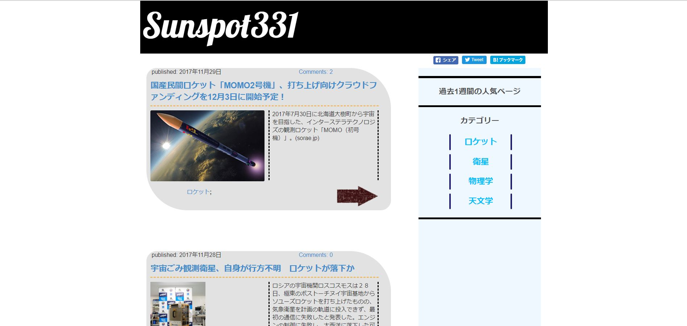
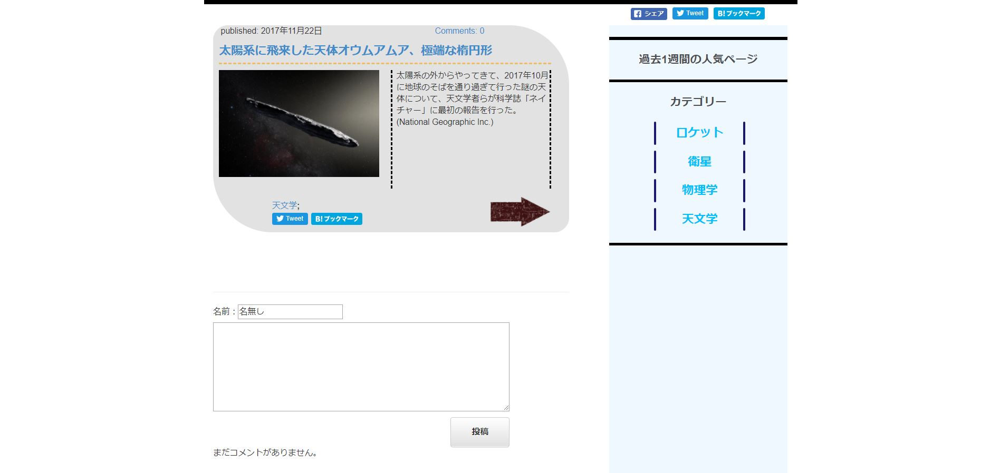

## ドキュメント

+ プログラムの概要(目的や背景などを含める)
  + 目的：主に2つあり、一つ目は使った事がないDjangoフレームワームになれる事。2つ目は1ヵ月間で作りたいと思ったWebサイトを作れるかどうか試す事(今回は宇宙に関する情報のニュースまとめサイトを作ろうと試みた)
  + 背景：これを作成したのはソフトバンクのインターンシップ終わりが終わって10か程が経った後の2017年の10月の1か月間で作成した。これは、ソフトバンクのインターンシップに行っている間私は、シェアハウスに住まわせて頂いていたのだが、そこにいた他大学の工学部の人たちのスキルや、ソフトバンクのインターンシップに参加している人たちのスキルを見て、”このままではダメだ”と思い、スキルアップの目的の自主的に作ろうと思ったのが背景にある。

+ 使用言語、フレームワーク
  + Pythonを使用。フレームワークはDjango。

+ プログラムを実行しなくとも動作が理解できる画像のキャプチャ画像など
  + メインページ

  + 詳細ページ(コメントも書ける)

+ 起動方法、操作方法
  + 起動方法
    1. "https://sunspot331.herokuapp.com/"にアクセス

  + 操作方法
    1. 画面中央に表示されている記事のトピックスで気になる記事にアクセスする
    2. または画面右側に表示されているカテゴリーから、気になるものを選択し、画面中央に表示されたトピックスの中から気になる記事にアクセスする
    3. リンク先に飛んで、ニュースを見る

+ ソースコードの解説
  + /space_post/settings.pyでデータベースの設定やメディアファイルや言語の設定など、各種設定を行っている。
  + /space_post/urls.pyでルーティングを行っている。
  + /space_post_app/admin.pyで、管理者ページ内に、カラムに連携されたデータの項目を追加
  + /space_post_app/forms.pyでコメント部分で用いるフォームの設定をしている
  + /space_post_app/models.pyでデータベースへの操作であるモデルを作成している
    + class Categoryは記事のカテゴリをモデル
    + class Articleは記事本体のモデル
    + class Commentは記事に対するコメントのモデル
    + class PopularPostは人気記事ランキングのためのモデル
  + /space_post_app/urls.pyでルーティングを行っている
  + /space_post_app/views.pyは、railsでいうコントローラの役割をしている。
  + /templates/space_post/base.htmlで全ページの共通部分を作成している
    + View数により、過去一週間の人気ページがランキング形式で表示されるようになっている。(最大10件)
    + Facebook, Twitter, はてなブックマークで共有を行う事ができる。
  + /templates/space_post/post_category.htmlでカテゴリ別の記事の表示を行うページを作成している
  + /templates/space_post/post_detail.htmlで読みたい記事をクリックした時の詳細ページを作成している
  + /templates/space_post/post_list.htmlで記事のトピックスを表示している部分を作成している

  + 共通部分としては、GoogleAnalyticsAPIを入れており、連携させているので、ページごとのアクティブユーザ数などを知る事ができるようになっている。
  + /staticには、cssファイルとJavaScriptファイルとmediaファイルを格納している。

+ 必要なライブラリ、ランタイム、環境
  + 必要なライブラリ、ランタイム
    1. Djangoに標準搭載されているライブラリ
    2. requirements.txtに書いてあるライブラリ

  + 環境
    + クライアントとして使用する分には、HTTPSなので、ネットにさえ繋がっていれば全てのコンピュータで閲覧可能である。
    + サーバOSに関しては、"heroku"PaaSサービスを用いてデプロイしている。
    + Pythonのバージョンは3.6.2
    + データベースは、開発はDjangoにデフォルトで付いているSQLite3だが、herokuではPostgreSQLを用いている

+ 課題や展望
  1. Djangoを使用したのは今回が初めてであり、蛇足な処理や設定をしている部分が多々あると思われるので、そういった部分の改善をまずは行いたいと考える。
  2. 今後の展望としては、作りたいと思ったものは作れたが、現在の状況では著作権的にOUTなサイトであり、かつ、オリジナリティのかけらもないので、今後は自分が読んだ宇宙に関する本の書評ブログにしようと考えている。
  3. その他の改善点としては、記事を削除した際、その記事に使用した画像は残り続けてしまっているのでその画像の削除もできるようにしなければならない。

+ 自己評価、感想
    100点満点中80点だと考える。これは、Webページとしては完成度はあまり高くなく、セキュリティ的にも著作権的にも危うい所はあったが、Webサイトとしての基本機能やデザインは実装する事ができ、Djangoにも少しは慣れ親しんだので、目的の2つをある程度満たす事ができたと考え、80点という点数をつけた。
    感想は、Railsに関しては、日本語のドキュメントも非常に多かったり、Railsの学習サイトがあったりと、比較的学びやすかったのだが。Djangoに関しては、日本語のドキュメントや学習サイトがほとんど見当たらず、あったとしても自分が作成したい機能に関わるものが無かったりと、非常に苦労を要した事は記憶に新しい。その時私は、Djnagoやその他の開発のためにも、"もっと英語を勉強しなければならないな"とつくづく思った。

+ 参考文献、URL
  1. 【Django入門】urls.py（URLConf）の役割と使い方<http://www.sejuku.net/blog/26584>
  2. 【Django入門】フォーム（forms）を作ってみよう<http://www.sejuku.net/blog/30742#i-6>
  3. タグDjango<http://www.sejuku.net/blog/tag/django/page/2>
  4. PyCharm の便利な使い方<https://pythondatascience.plavox.info/python%E3%81%AE%E9%96%8B%E7%99%BA%E7%92%B0%E5%A2%83/pycharm%E3%81%AE%E4%BE%BF%E5%88%A9%E3%81%AA%E4%BD%BF%E3%81%84%E6%96%B9>
  5. Django ドキュメント<http://djangoproject.jp/doc/ja/1.0/index.html>
  6. Documentation<https://docs.djangoproject.com/ja/1.11/intro/>
  7. Deploy!<https://djangogirlsjapan.gitbooks.io/workshop_tutorialjp/content/deploy/>
  8. windows環境でのvirutalenvwrapper<https://qiita.com/maisuto/items/91143d26b609d6cfc1ac>
  9. Djangoを学ぶ(3):画像の表示<http://www.tohuandkonsome.site/entry/2017/06/10/211145>
  10. DjangoにおけるSTATIC_ROOT,STATICFILES_DIRS, STATIC_URLの違いとは<https://ja.stackoverflow.com/questions/38052/django%E3%81%AB%E3%81%8A%E3%81%91%E3%82%8Bstatic-root-staticfiles-dirs-static-url%E3%81%AE%E9%81%95%E3%81%84%E3%81%A8%E3%81%AF>
  11. 枠線などを指定したい！CSSのborderの使い方【初心者向け】<https://techacademy.jp/magazine/8626>
  12. Django、on_deleteを使う(django2.0から必須)<https://torina.top/detail/297/>
  13. Djangoで、グーグルアナリティクスから人気ページを取得し表示する<https://torina.top/detail/355/>
  14. Django、ブログに使っているModel<https://torina.top/detail/256/>
  15. Django: フォーム内の選択項目をモデルの値で絞る<http://blog.uc8.jp/?p=189>
  16. Django でページング<http://atasatamatara.hatenablog.jp/entry/2013/04/03/211454>
  17. Herokuで単純なrubyスクリプトを定期的に実行する<https://qiita.com/kasei-san/items/909f17c2c42b7e3a8489>
  18. レポートの作成<https://developers.google.com/analytics/devguides/reporting/core/v4/basics?hl=ja>
  19. Facebook・TwitterのOGP設定方法まとめ<https://ferret-plus.com/610>
  20. シェアデバッガー<https://developers.facebook.com/tools/debug/sharing/?q=https%3A%2F%2Fsunspot331.herokuapp.com%2F>
  21. twitter/Facebook/LINEのシェアボタンのカスタマイズ方法<https://qiita.com/rico/items/a8ec7626e357ff34570b>
  22. django テンプレートで markdown から html へ変換する<https://qiita.com/teaka_experimen/items/d8fe5deba2f71cfa1de7>
